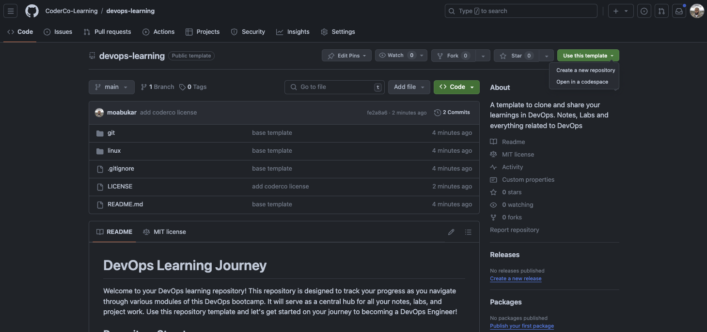
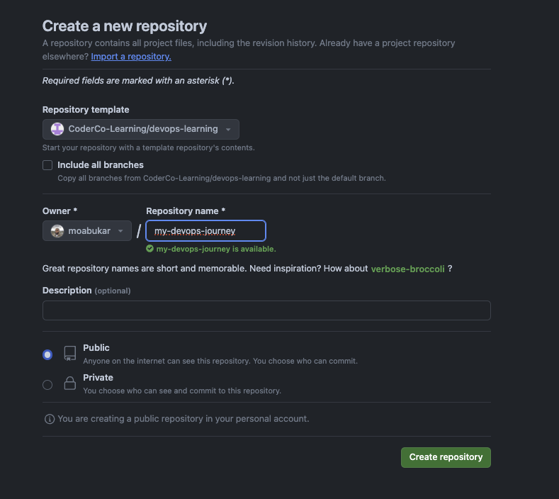

# Welcome to My DevOps Journey!

Hi there! 👋 I'm a aspiring DevOps engineer, currently diving deep into the world of DevOps. This repository will serve as the place where I document my learning and projects as I progress on my journey in this field.

## Initial setup


-------


## Repository Structure

This repository is organized into multiple modules, each representing a core area of DevOps. You will find a dedicated folder for each module where you can store your notes, labs, and any other relevant materials.

## Sample Directory Structure

Here's how your directory structure should look like as you progress through the bootcamp. This is an example of what your repository might look like after completing a few modules:

Example layout for repo only. Yours could be different but this is inspiration. 

```bash
devops-learning/
├── Linux/
│   ├── notes/
│   │   ├── linux-basics.md
│   │   ├── file-system.md
│   │   └── shell-scripting.md
│   ├── labs/
│   │   ├── lab1-basic-commands.md
│   │   ├── lab2-file-permissions.md
│   │   └── lab3-shell-scripting.md
│   └── projects/
│       ├── project1-custom-script/
│       │   ├── script.sh
│       │   └── README.md
│       └── project2-linux-server-setup/
│           ├── setup-notes.md
│           └── README.md
│
├── Git/
│   ├── notes/
│   │   ├── version-control-basics.md
│   │   ├── branching-and-merging.md
│   │   └── git-workflow.md
│   ├── labs/
│   │   ├── lab1-initial-commit.md
│   │   ├── lab2-branching.md
│   │   └── lab3-merge-conflicts.md
│   └── projects/
│       ├── project1-git-repo-setup/
│       │   ├── init-repo.sh
│       │   └── README.md
│       └── project2-collaboration-workflow/
│           ├── collaboration-notes.md
│           └── README.md
│
├── AWS/
│   ├── notes/
│   │   ├── aws-overview.md
│   │   ├── ec2-basics.md
│   │   └── s3-setup.md
│   ├── labs/
│   │   ├── lab1-ec2-instance.md
│   │   ├── lab2-s3-bucket.md
│   │   └── lab3-vpc-setup.md
│   └── projects/
│       ├── project1-hosting-on-ec2/
│       │   ├── deployment-notes.md
│       │   └── README.md
│       └── project2-static-website-on-s3/
│           ├── website-files/
│           └── README.md
│
├── Terraform/
│   ├── notes/
│   │   ├── terraform-basics.md
│   │   ├── providers-and-modules.md
│   │   └── state-management.md
│   ├── labs/
│   │   ├── lab1-terraform-setup.md
│   │   ├── lab2-infrastructure-as-code.md
│   │   └── lab3-terraform-modules.md
│   └── projects/
│       ├── project1-infrastructure-deployment/
│       │   ├── main.tf
│       │   ├── variables.tf
│       │   └── README.md
│       └── project2-multi-environment-setup/
│           ├── dev/
│           ├── prod/
│           └── README.md
│
└── README.md
```

### Modules

- **Linux:** Learn the basics and advanced concepts of Linux, the backbone of many DevOps tools.
- **Git:** Master version control using Git, a fundamental skill in DevOps.
- **AWS:** Dive into Amazon Web Services and learn how to manage cloud infrastructure.
- **Terraform:** Automate your infrastructure with Terraform, an Infrastructure as Code (IaC) tool.
- **Kubernetes:** Explore Kubernetes for container orchestration.
- **Docker:** Learn about containerization using Docker.
- **CI/CD:** Implement Continuous Integration and Continuous Deployment pipelines.
- **Networking:** Understand the fundamentals of networking and how it applies to DevOps.

## How to Use This Repository

- Make sure to have a GitHub account first
- Use the repo template and make your own repo from this into your GitHub Account
- Clone your repo locally and work on it.

## Best Practices

- Stay Organised: Keep your notes and labs organized in their respective module folders.
- Commit Often: Make regular commits to ensure you are tracking your progress effectively.

- Share Your Progress: Create LinkedIn posts about your journey and share your repository link. Don’t forget to tag @CoderCo!

- Ask for Help: If you get stuck, don't hesitate to reach out to the community or your mentors

## License

This repository is licensed under the MIT License. Feel free to use it as a template for your learning journey.

## Contact
For any questions or support, reach out to CoderCo or ask in our discussion forums.
